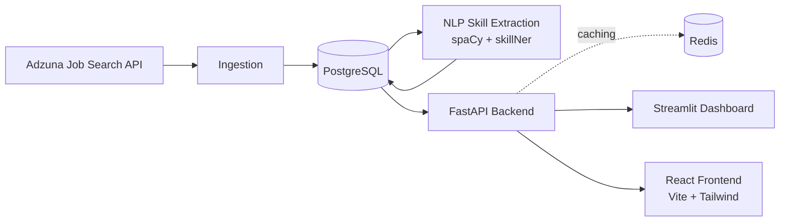

# NextSkill

**Evidence-based career intelligence for the tech job market — free, and built for individuals, not enterprises.**

[](https://github.com/DharmiSapariya/NextSkill/actions/workflows/ci.yml)


> Every number in this README reflects real data currently sitting in a live database, or a feature actually exercised end to end against a live backend — not a mockup or a planned design. Anything still in progress is labeled as such rather than described like it's finished.

---

## The problem

Thousands of tech job postings go up every day, each one implicitly signaling what employers actually value right now. Nobody accessible to an individual turns that signal into a straight answer to the only question that matters: **what should I learn next, and is it worth it?**

The tools that *do* answer this well are locked behind enterprise sales:

| Tool | What it's good at | Where an individual loses |
|---|---|---|
| Lightcast / TalentNeuron | Deep labor-market modeling, role-transition data | Enterprise-only, sales-gated, unaffordable for a person |
| LinkedIn Talent Insights | Aggregate hiring trends | Built for recruiters, not job seekers |
| Jobscan / Teal | Resume-to-job-description matching | One listing at a time — gameable, no market signal |
| **NextSkill** | Skill-gap recommendations backed by real postings, free | — |

NextSkill sits in the gap: transparent about its methodology, grounded in aggregate real-market data, and free.

## What makes this different

Every recommendation traces back to real postings — click into any number and see the evidence, not a black-box score. That's the whole design philosophy, not just a tagline: the trend endpoint documents its own methodology in its response, the recommend endpoints attach real postings as evidence, and every "coming soon" feature below inherits the same rule before it ships.

## Architecture



## What's live right now

**Backend / API**

- **Real user accounts** — signup/login (JWT), a persistent saved skill profile per user, password change, account deletion
- **Skill-gap recommendation engine** — ranked by real posting demand, every recommendation backed by actual postings as evidence, not a score
- 🧾 **Resume parsing + statistical match score** — upload a PDF/DOCX resume, auto-populate your skill profile, and get a match percentage computed against *hundreds* of real postings for your target role — not a single-JD keyword scan
- 🎯 **Per-posting match score** — how well your profile matches one *specific* listing, not just a whole role's worth of postings
- 💰 **Salary prediction** — a model trained on real posting salary data, answering "what is learning Docker actually worth in dollars for this role"
- 🕸️ **Role-transition graph** and **skill co-occurrence graph** — graph-shaped endpoints (nodes + weighted edges) built from real skill overlap, not guesswork
- **Job search** — paginated, filterable by role, location, and seniority, plus bookmarking (saved jobs)
- **Skill demand trends** — month-over-month share of postings mentioning a skill, labeled rising / falling / flat / new, methodology included in the response
- **Skill and company directories** — searchable/paginated browse endpoints, plus a fixed top-hiring-companies leaderboard
- **Recommendation history & progress** — every past run is recorded; a progress endpoint diffs your first and latest run for a role into skills closed / still open / newly opened
- **Shareable public reports** — publish a past recommendation run as a login-free public link, revocable, never on by default
- **Digest** — on-demand computation of "what changed since your last run" across every role you've checked (email delivery not wired up — this environment has no SMTP credentials to send it with)
- **Semantic role matching** — a sentence-transformers fallback when a target role doesn't exact-match a tracked role or known alias
- **Tiered access** — free vs. pro gates evidence depth and history page size, not feature access itself
- **Admin endpoints** — platform-wide stats and user management (`/admin/*`) — API only; no admin UI yet
- **Redis-cached** graph/trend/related-skill endpoints, structured logging, and Sentry error tracking
- **CORS-enabled API**, **Dockerized** (API + Postgres), **Alembic-migrated** schema, CI running the full test suite (108 tests) against a seeded database on every push

**Frontend** (React 19 + Vite + Tailwind)

- A full marketing landing page — animated hero, scroll-triggered sections, a recolored illustration set, custom cursor
- Seven feature pages, each a real integration against the API above, not a placeholder: **Jobs** (search/filter/bookmark/detail), **Companies** (leaderboard + directory), **Explore a Skill** (search + trend + related skills), **Skill Network** and **Career Paths** (interactive graph visualizations, plain SVG, no charting library), **Recommend** (skill-gap results with evidence, history, progress, sharing), **Resume & Salary** (resume upload, match score, salary estimate)
- **My Account** — profile, editable skill profile, digest, saved jobs, shared-report management, password change, account deletion
- A public, login-free **Reports** page for shared recommendation links

Backed by **~3,000 real job postings** across 21 tech roles and **~6,900 extracted skill mentions** — noise-filtered, duplicate-merged, nothing synthetic.

## API reference

**Open endpoints** (no auth required):

| Method | Path | Description |
|---|---|---|
| GET | `/health` | Liveness check |
| GET | `/jobs` | Paginated job search, filterable by role/location/seniority |
| GET | `/jobs/{job_id}` | Single posting detail |
| GET | `/companies` | Paginated/searchable company directory |
| GET | `/companies/top` | Top hiring companies by posting volume |
| GET | `/skills` | Paginated/searchable skill browse, grounded in real mention counts |
| GET | `/skills/{skill_name}/related` | Skill co-occurrence |
| GET | `/skills/co-occurrence-graph` | Graph-shaped skill co-occurrence data |
| GET | `/trends/{skill_name}` | Month-over-month demand for a skill |
| GET | `/roles/transition-graph` | Full graph (nodes + edges) of role-to-role skill similarity |
| GET | `/roles/{role}/nearest` | Nearest roles to a given role by skill overlap, with exact delta skills |
| GET | `/reports/{token}` | A published shared recommendation report |

**Auth:**

| Method | Path | Description |
|---|---|---|
| POST | `/auth/signup` | `{email, password}` → JWT access token |
| POST | `/auth/login` | `{email, password}` → JWT access token |
| POST | `/auth/refresh` | Exchange a valid token for a fresh one |
| GET | `/auth/me` | Current user + saved skill profile |
| PUT | `/auth/me/skills` | Update saved skill profile |
| PUT | `/auth/me/password` | Change password (requires current password) |
| DELETE | `/auth/me` | Delete account and everything tied to it (requires password) |
| POST | `/auth/me/resume` | Upload a PDF/DOCX resume — extracts and merges skills into your profile |
| GET | `/auth/me/history` | Past `/recommend` / `/recommend/evidence` runs |
| GET | `/auth/me/history/progress` | First-run-vs-latest-run diff for a target role |
| GET | `/auth/me/digest` | What changed since your last run, across every role you've checked |
| POST | `/auth/me/history/{history_id}/share` | Publish a past run as a public link |
| GET | `/auth/me/shared-reports` | Your own published links |
| DELETE | `/auth/me/history/shared/{token}` | Revoke a published link |
| GET | `/auth/me/saved-jobs` | Your bookmarked postings |

**Protected** (require `Authorization: Bearer <token>`, rate-limited to 10 req/min):

| Method | Path | Description |
|---|---|---|
| POST | `/recommend` | Skill-gap recommendations ranked by market demand. `skills` in the body is optional — omit it to use your saved profile |
| POST | `/recommend/evidence` | Same, with real postings attached as evidence for every recommendation |
| POST | `/match-score` | Statistical match % of your skills against real postings for a target role |
| GET | `/jobs/{job_id}/match` | Match % against one specific posting's actual required skills |
| POST | `/predict-salary` | Predicted salary range for a target role + skill set, trained on real posting data |
| POST | `/jobs/{job_id}/save` | Bookmark a posting (idempotent) |
| DELETE | `/jobs/{job_id}/save` | Remove a bookmark |

**Admin only:**

| Method | Path | Description |
|---|---|---|
| GET | `/admin/stats` | Platform-wide aggregate stats |
| GET | `/admin/users` | Searchable/paginated user list |
| PUT | `/admin/users/{user_id}` | Update a user (tier, admin flag) |
| DELETE | `/admin/users/{user_id}` | Remove a user |

## Project structure

```
NextSkill/
├── backend/            FastAPI app, data pipeline, ORM models, Alembic migrations, tests, Dockerfile
├── dashboard/           Streamlit dashboard (talks to the API over HTTP only)
├── frontend/            React + Vite + Tailwind app — the primary consumer-facing product surface
└── .github/workflows/   CI — pytest against a seeded Postgres service on every push
```

## Tech stack

**Backend**
- **Language:** Python 3.12
- **Database:** PostgreSQL 16 (Docker Compose, host port 5433), schema managed via Alembic
- **ORM:** SQLAlchemy 2.x
- **NLP:** spaCy (`en_core_web_lg`) + skillNer, built on the EMSI/Lightcast open skills database; sentence-transformers for semantic role-name fallback matching
- **Data source:** Adzuna Job Search API
- **Backend:** FastAPI + Uvicorn, `slowapi` for rate limiting, JWT auth (`python-jose` + `passlib`/bcrypt), APScheduler for scheduled ingestion
- **Caching:** Redis (graph/trend/related-skill endpoints)
- **Testing:** pytest, running in CI against a real seeded Postgres instance — not mocked
- **Error tracking:** Sentry

**Frontend**
- React 19, Vite, Tailwind CSS, React Router
- Framer Motion + GSAP (ScrollTrigger) for animation
- lucide-react for icons; no charting/graph library — the skill-network and career-path visualizations are plain inline SVG

**Dashboard**
- Streamlit

## Getting started

**Backend + API:**

```bash
git clone https://github.com/DharmiSapariya/NextSkill.git
cd NextSkill/backend
python3 -m venv .venv
source .venv/bin/activate
pip install -r requirements.txt
cp .env.example .env              # fill in ADZUNA_APP_ID / ADZUNA_APP_KEY / JWT_SECRET_KEY
docker compose up -d db           # starts Postgres on port 5433

python3 models.py                                              # creates the database schema
python3 fetch_adzuna.py                                         # pulls postings from Adzuna
python3 load_data.py                                            # loads postings into PostgreSQL
pip install -r requirements-nlp.txt && python -m spacy download en_core_web_lg
NLTK_DISABLE_IMPORT_SECURITY=1 python3 extract_skillner.py       # extracts skills via NLP
python3 extract_languages.py                                     # supplementary extraction for common single-word skills

uvicorn api:app --reload --port 8000     # starts the API on :8000
```

(A fresh clone can also seed the schema with `python3 seed_test_data.py` instead of running the full Adzuna ingestion pipeline, if you just want something to develop against.)

**Frontend:**

```bash
cd frontend
npm install
npm run dev                       # starts the Vite dev server, defaults to talking to localhost:8000
```

Copy `frontend/.env.example` to `.env` and set `VITE_API_BASE_URL` if the API isn't on the default local port.

**Dashboard:**

```bash
cd dashboard
pip install -r requirements.txt
streamlit run streamlit_app.py
```

Or bring up the API + Postgres together:

```bash
cd backend
docker compose up --build   # starts Postgres + the API on port 8000
```

## Known limitations

- **Trend comparison** currently spans two months (June–July 2026) restricted to a fixed set of 8 core roles, to control for search coverage expanding from a smaller initial role set to 21 roles over the project's timeline. This isn't a forecast — a real time-series model needs several more months of consistent data before it would add signal over this simpler comparison.
- **Role matching** in `/recommend` and `/trends` matches exact substrings and known aliases first; a sentence-transformers semantic fallback only kicks in when neither hits, so an unusual role phrasing can still resolve to the wrong tracked role.
- **Digest is computation-only.** `/auth/me/digest` correctly identifies what changed since your last run, but there's no email delivery behind it — this environment has no SMTP credentials to send from. It's fully usable from My Account today; the "weekly notification" part of the idea isn't built.
- **Admin has no frontend.** The admin endpoints (stats, user management) work and are covered by tests, but there's no UI for them yet — the Admin page in the frontend is still a placeholder.
- **Seed/dev data isn't production data.** `seed_test_data.py` exists purely so the test suite (and local development) has something to query against; it includes a handful of deliberately-named fixture rows (`pipeline-test-skill-*`) that show up if you browse the dev database directly. The ~3,000-posting / ~6,900-mention figures above describe the real ingested dataset, not this fixture data.

## Roadmap

Phases are ordered by leverage, not by calendar.

| Phase | Theme | What's in it |
|---|---|---|
| ✅ Shipped | Foundation | Auth, skill-gap recommender w/ evidence, trends, co-occurrence, CORS, Docker + CI |
| ✅ Shipped | The three differentiators | Resume parsing + statistical match score, salary prediction, role-transition graph |
| ✅ Shipped | Trust infrastructure | Alembic migrations, scheduled ingestion (APScheduler), Redis caching, structured logging + Sentry |
| ✅ Shipped | Smarter matching | Semantic role-name fallback matching, skill lifecycle labels, seniority segmentation |
| ✅ Shipped | Retention | Recommendation history + progress tracking, shareable public skill-report pages, on-demand digest (no email delivery yet) |
| ✅ Shipped | Product surface | Tiered access, graph-shaped endpoints, saved jobs, per-posting match score, and the full React frontend consuming all of it |
| Next | Live deployment | Hosting the API, frontend, and a production database somewhere other than local dev |
| Then | Admin UI | A real frontend for the existing `/admin/*` endpoints |
| Then | Digest delivery | Actual email/notification delivery for the existing digest computation |
| Then | Percentile match scoring | A richer match-score distribution beyond the current pass/fail-style coverage threshold |

## Contributors

Built by [Dharmi Sapariya](https://github.com/DharmiSapariya) and [Bhavya Srimanduri](https://github.com/bhavyasrimanduri-bhavya).

This README is updated as the project progresses — see the commit history for the full record of development, including the debugging process.
