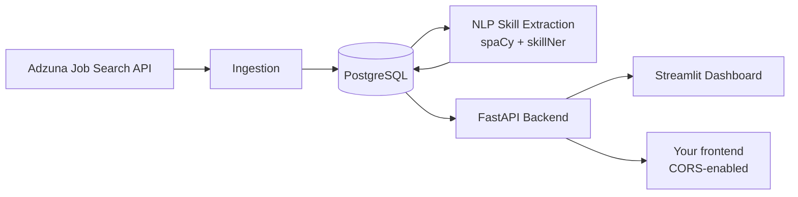

# NextSkill

**Evidence-based career intelligence for the tech job market — free, and built for individuals, not enterprises.**

[](https://github.com/DharmiSapariya/NextSkill/actions/workflows/ci.yml)


> Every number in this README reflects real data currently sitting in a live database. Nothing here is simulated, projected, or a demo dataset — including the parts that are still being built, which are labeled as such.

---

## The problem

Thousands of tech job postings go up every day, each one implicitly signaling what employers actually value right now. Nobody accessible to an individual turns that signal into a straight answer to the only question that matters: **what should I learn next, and is it worth it?**

The tools that *do* answer this well are locked behind enterprise sales:

| Tool | What it's good at | Where an individual loses |
|---|---|---|
| Lightcast / TalentNeuron | Deep labor-market modeling, role-transition data | Enterprise-only, sales-gated, unaffordable for a person |
| LinkedIn Talent Insights | Aggregate hiring trends | Built for recruiters, not job seekers |
| Jobscan / Teal | Resume-to-job-description matching | One listing at a time — gameable, no market signal |
| **NextSkill** | Skill-gap recommendations backed by real postings, free | — |

NextSkill sits in the gap: transparent about its methodology, grounded in aggregate real-market data, and free.

## What makes this different

Every recommendation traces back to real postings — click into any number and see the evidence, not a black-box score. That's the whole design philosophy, not just a tagline: the trend endpoint documents its own methodology in its response, the recommend endpoints attach real postings as evidence, and every "coming soon" feature below inherits the same rule before it ships.

## Architecture



## What's live right now

- **Real user accounts** — signup/login (JWT), a persistent saved skill profile per user
- **Skill-gap recommendation engine** — ranked by real posting demand, every recommendation backed by actual postings as evidence, not a score
- 🧾 **Resume parsing + statistical match score** — upload a PDF/DOCX resume, auto-populate your skill profile, and get a match percentage computed against *hundreds* of real postings for your target role — not a single-JD keyword scan
- 💰 **Salary prediction** — a model trained on real posting salary data, answering "what is learning Docker actually worth in dollars for this role"
- 🕸️ **Role-transition graph** — which roles are realistically one skill-gap away versus three, built from real skill co-occurrence, not guesswork
- **Job search** — paginated, filterable by role and location
- **Skill demand trends** — month-over-month share of postings mentioning a skill, labeled rising / falling / flat / new, methodology included in the response
- **Skill co-occurrence** — "what else commonly gets asked for alongside React"
- **Top hiring companies** — ranked by real posting volume
- **CORS-enabled API** — ready for a separately hosted frontend
- **Dockerized** (API + Postgres) with CI running the full test suite (30 tests) against a seeded database on every push

Backed by **~3,000 real job postings** across 21 tech roles and **~6,900 extracted skill mentions** — noise-filtered, duplicate-merged, nothing synthetic.

## API reference

**Open endpoints** (no auth required):

| Method | Path | Description |
|---|---|---|
| GET | `/health` | Liveness check |
| GET | `/jobs` | Paginated job search, filterable by role/location |
| GET | `/jobs/{job_id}` | Single posting detail |
| GET | `/companies/top` | Top hiring companies by posting volume |
| GET | `/trends/{skill_name}` | Month-over-month demand for a skill |
| GET | `/skills/{skill_name}/related` | Skill co-occurrence |

**Auth:**

| Method | Path | Description |
|---|---|---|
| POST | `/auth/signup` | `{email, password}` → JWT access token |
| POST | `/auth/login` | `{email, password}` → JWT access token |
| GET | `/auth/me` | Current user + saved skill profile |
| PUT | `/auth/me/skills` | Update saved skill profile |
| POST | `/auth/me/resume` | Upload a PDF/DOCX resume — extracts and merges skills into your profile |

**Protected** (require `Authorization: Bearer <token>`, rate-limited to 10 req/min):

| Method | Path | Description |
|---|---|---|
| POST | `/recommend` | Skill-gap recommendations ranked by market demand. `skills` in the body is optional — omit it to use your saved profile |
| POST | `/recommend/evidence` | Same, with real postings attached as evidence for every recommendation |
| POST | `/match-score` | Statistical match % of your skills against real postings for a target role |
| POST | `/predict-salary` | Predicted salary range for a target role + skill set, trained on real posting data |

**Role graph** (no auth required):

| Method | Path | Description |
|---|---|---|
| GET | `/roles/transition-graph` | Full graph (nodes + edges) of role-to-role skill similarity |
| GET | `/roles/{role}/nearest` | Nearest roles to a given role by skill overlap, with exact delta skills |

## Project structure

```
NextSkill/
├── backend/           FastAPI app, data pipeline, ORM models, tests, Dockerfile
├── dashboard/          Streamlit frontend (talks to the API over HTTP only)
└── .github/workflows/  CI — pytest against a seeded Postgres service on every push
```

## Tech stack

- **Language:** Python 3.12
- **Database:** PostgreSQL 16 (Docker Compose, host port 5433)
- **ORM:** SQLAlchemy 2.x
- **NLP:** spaCy (`en_core_web_lg`) + skillNer, built on the EMSI/Lightcast open skills database
- **Data source:** Adzuna Job Search API
- **Backend:** FastAPI + Uvicorn, `slowapi` for rate limiting, JWT auth (`python-jose` + `passlib`/bcrypt)
- **Testing:** pytest, running in CI against a real seeded Postgres instance — not mocked
- **Dashboard:** Streamlit

## Getting started

```bash
git clone https://github.com/DharmiSapariya/NextSkill.git
cd NextSkill/backend
python3 -m venv .venv
source .venv/bin/activate
pip install -r requirements.txt
cp .env.example .env              # fill in ADZUNA_APP_ID / ADZUNA_APP_KEY / JWT_SECRET_KEY
docker compose up -d db           # starts Postgres on port 5433

python3 models.py                                              # creates the database schema
python3 fetch_adzuna.py                                         # pulls postings from Adzuna
python3 load_data.py                                            # loads postings into PostgreSQL
pip install -r requirements-nlp.txt && python -m spacy download en_core_web_lg
NLTK_DISABLE_IMPORT_SECURITY=1 python3 extract_skillner.py       # extracts skills via NLP
python3 extract_languages.py                                     # supplementary extraction for common single-word skills

uvicorn api:app --reload --port 8000     # in one terminal — starts the API

cd ../dashboard
pip install -r requirements.txt
streamlit run streamlit_app.py           # in another terminal — starts the dashboard
```

Or bring up the API + Postgres together:

```bash
cd backend
docker compose up --build   # starts Postgres + the API on port 8000
```

## Known limitations

- **Trend comparison** currently spans two months (June–July 2026) restricted to a fixed set of 8 core roles, to control for search coverage expanding from a smaller initial role set to 21 roles over the project's timeline. This isn't a forecast — a real time-series model needs several more months of consistent data before it would add signal over this simpler comparison.
- **Role matching** in `/recommend` and `/trends` uses exact substring matching against job titles, so a target role phrase must closely match how roles appear in the underlying postings. Semantic/embedding-based matching is planned.

## Roadmap

Phases are ordered by leverage, not by calendar.

| Phase | Theme | What's in it |
|---|---|---|
| ✅ Shipped | Foundation | Auth, skill-gap recommender w/ evidence, trends, co-occurrence, CORS, Docker + CI |
| ✅ Shipped | The three differentiators | Resume parsing + statistical match score, salary prediction, role-transition graph |
| Next | Trust infrastructure | Alembic migrations, scheduled ingestion, Redis caching, structured logging + Sentry, live deployment |
| Then | Smarter matching | Semantic skill/role matching via embeddings, skill lifecycle labels, seniority segmentation |
| Then | Retention | Recommendation history over time, shareable public skill-report pages, weekly digest notifications |
| Then | Product | Tiered access, percentile match scoring, admin/analytics dashboard, graph-shaped endpoints for a visualization-heavy frontend |

## Contributors

Built by [Dharmi Sapariya](https://github.com/DharmiSapariya) and [Bhavya Srimanduri](https://github.com/bhavyasrimanduri-bhavya).

This README is updated as the project progresses — see the commit history for the full record of development, including the debugging process.
